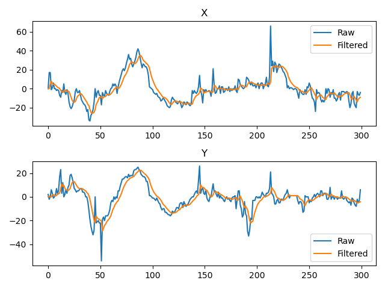

# SilkTrack

A real-time Windows user-mode service that cancels mouse jitter on rough surfaces using a Kalman filter, built directly on the Windows HID stack.


### Filter Performance

Raw vs filtered mouse deltas (X and Y axes) on a rough surface:



---

## The Problem

When a mouse moves across a rough or uneven surface, the optical sensor picks up high-frequency noise — small erratic deltas that have nothing to do with your intended movement. Windows applies its own post-processing, but this operates on already-abstracted cursor coordinates and can't cleanly separate true movement from surface noise.

SilkTrack intercepts the raw sensor data **before** Windows processes it, applies a Kalman filter to separate signal from noise, and injects the cleaned movement back — transparent to any application.

---

## How It Works

```
Mouse hardware
      ↓
mouhid.sys  (HID minidriver)
      ↓
WH_MOUSE_LL hook  ←  SilkTrack blocks hardware input here
      ↓  (blocked)
      ↓
WM_INPUT message  ←  SilkTrack reads raw deltas here via GetRawInputData
      ↓
Kalman filter     ←  noise cancelled
      ↓
SendInput()       ←  clean movement injected back
      ↓
Windows cursor
```

Three things happen on every mouse event:

1. **Block** — a low-level mouse hook (`WH_MOUSE_LL`) intercepts the hardware event before it reaches the cursor. Non-synthetic events are swallowed.
2. **Read** — `GetRawInputData` reads the true `lLastX / lLastY` deltas directly from the HID stack — not the already-processed screen coordinates.
3. **Filter + Inject** — the Kalman filter smooths the deltas, and `SendInput` injects the result back with a magic marker (`0x5E1D`) so SilkTrack can identify and skip its own events.

---

## The Kalman Filter

Mouse movement is modelled as a constant-velocity system. The state vector is:

```
x = [position, velocity]ᵀ
```

### Predict

```
x̂⁻  =  F · x̂          (predict state forward)
P⁻   =  F · P · Fᵀ + Q  (uncertainty grows during prediction)
```

Where `F` is the state transition matrix and `Q` is the process noise covariance — how much the model is expected to deviate from constant velocity.

### Update

```
K   =  P⁻ · Hᵀ · (H · P⁻ · Hᵀ + R)⁻¹   (Kalman gain)
x̂  =  x̂⁻ + K · (z − H · x̂⁻)           (fuse measurement with prediction)
P   =  (I − K · H) · P⁻                  (reduce uncertainty after measurement)
```

Where:

- `z` is the raw measured delta from the sensor
- `H = [1, 0]` — we only observe position, not velocity
- `R` is the measurement noise covariance — how much we trust the sensor
- `K` is the Kalman gain — the optimal blend between prediction and measurement

**Intuition:**

- High `K` → trust the sensor → responsive but noisier
- Low `K` → trust the model → smoother but more lag

Since X and Y mouse axes are completely independent, two separate 1D Kalman filters run in parallel — one per axis.

---

## Tuning

| Parameter | Effect                                | Rough surface | Smooth surface |
| --------- | ------------------------------------- | ------------- | -------------- |
| `Q_scale` | Higher = more responsive, less smooth | Lower         | Higher         |
| `R`       | Higher = more smoothing, more lag     | Higher        | Lower          |

Default values: `Q_scale=110, R=1500, mouse_hz=1000`

---

## Architecture

```
silktrack/
├── anti_jitter_ai/
│   ├── main.py                 ← entry point
│   ├── anti_jitter.py          ← main class, wires everything together
│   ├── mouse_blocking_hook.py  ← WH_MOUSE_LL hook, blocks hardware input
│   ├── register_rid.py         ← registers RawInputDevice, creates message window
│   ├── kalman_filter_1d.py     ← Kalman filter implementation
│   ├── constants.py            ← Windows API constants
│   ├── structures.py           ← ctypes struct definitions
│   └── utils.py                ← shared helpers
```

---

## Requirements

```
pip install win32more numpy
```

Python 3.10+ on Windows 10/11 (64-bit).

---

## Usage

```bash
cd anti_jitter_ai
python main.py
```

Press `Ctrl+C` to stop. The hook is automatically uninstalled on exit.

To adjust smoothing, edit the parameters in `main.py`:

```python
anti_jitter = AntiJitter(Q_scale=110, R=1500, mouse_hz=1000)
```

---

## Notes

- Tested at 1000Hz polling rate. For higher polling rate mice (e.g. 8000Hz Razer HyperPolling) set `mouse_hz=8000`.
- Runs entirely in user mode — no kernel driver, no administrator privileges required beyond what `SetWindowsHookEx` needs.
- The synthetic input marker `0x5E1D` prevents feedback loops between the hook and the raw input reader.
